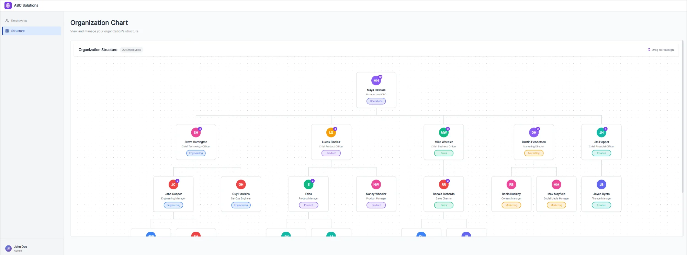
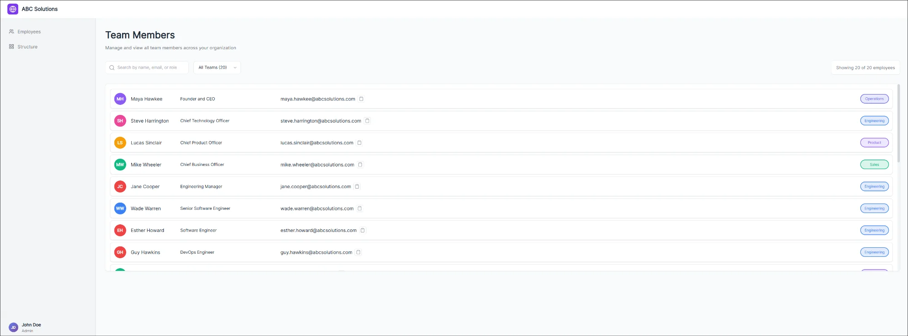

# Organization Chart

An interactive organization chart application that allows users to visualize company hierarchy, manage reporting structures, and reassign employees through an intuitive drag-and-drop interface.

Built with React 19, TypeScript, and modern web technologies.

<p align="center">
  
</p>

## Demo

🔗 **Live Demo:** [https://saikiran-48.github.io/organization-chart/](https://saikiran-48.github.io/organization-chart/)

📹 **Video Walkthrough:** [Watch Demo](YOUR_VIDEO_LINK_HERE)

## Features

### Employee Directory (Left Panel)

- **Complete Employee List** — View all team members with their name, designation, and team
- **Real-time Search** — Instantly filter employees by name, email, or role
- **Team Filtering** — Filter view by specific departments (Engineering, Product, Sales, etc.)
- **Quick Actions** — Copy email addresses to clipboard with one click

<p align="center">
  
</p>

### Organization Structure (Right Panel)

- **Hierarchical Visualization** — Tree-based chart showing complete reporting structure
- **Team-aware Display** — Color-coded badges identify each employee's department
- **Subordinate Count** — Visual indicators show team sizes at a glance
- **Filtered View** — When filtering by team, the chart updates to show only relevant employees

<p align="center">
  
</p>

### Drag & Drop Reassignment

- **Intuitive Interactions** — Drag any employee card and drop onto a new manager
- **Visual Feedback** — Clear drop zones and drag overlays guide the interaction
- **Cycle Prevention** — Smart validation prevents invalid hierarchies (e.g., reporting to your own subordinate)
- **Persistent Changes** — Manager updates are saved via API calls

## Tech Stack

| Layer | Technology |
|-------|------------|
| **Framework** | React 19 |
| **Language** | TypeScript 5.9 |
| **Build Tool** | Vite 7 |
| **Routing** | React Router v7 |
| **Drag & Drop** | @dnd-kit/core |
| **API Mocking** | MirageJS |
| **Testing** | Vitest + React Testing Library |
| **Linting** | ESLint |

## Getting Started

### Prerequisites

- Node.js 18 or higher
- npm or yarn

### Installation

```bash
# Clone the repository
git clone https://github.com/saikiran-48/organization-chart.git
cd organization-chart

# Install dependencies
npm install

# Start development server
npm run dev
```

The application will be available at `http://localhost:5173`

### Scripts

| Command | Description |
|---------|-------------|
| `npm run dev` | Start development server |
| `npm run build` | Create production build |
| `npm run preview` | Preview production build |
| `npm run lint` | Run ESLint |
| `npm run test` | Run test suite |
| `npm run test:coverage` | Run tests with coverage report |

## Architecture

### Project Structure

```
src/
├── components/           # UI Components
│   ├── AppLayout/        # Main layout wrapper
│   ├── EmployeeNodes/    # Tree node for org chart
│   ├── ErrorPage/        # Error boundaries & 404
│   ├── OrgChart/         # Organization chart container
│   └── SidebarContainer/
│       ├── EmployeeList/ # Employee directory
│       ├── SearchBox/    # Search input
│       ├── SideBar/      # Navigation sidebar
│       └── TeamFilter/   # Department filter
│
├── hooks/
│   └── useEmployees.ts   # Employee data & state management
│
├── pages/
│   ├── EmployeeListPage.tsx
│   └── OrgChartPage.tsx
│
├── server/
│   ├── data.ts           # Mock employee data
│   └── mirage.ts         # MirageJS configuration
│
├── shared/               # Reusable components
│   ├── Avatar/
│   └── TeamBadge/
│
├── types/
│   └── employeeTypes.ts  # TypeScript definitions
│
└── utils/
    └── treeUtils.ts      # Tree algorithms
```

### API Endpoints

The application uses MirageJS to simulate a REST API:

| Method | Endpoint | Description |
|--------|----------|-------------|
| GET | `/api/employees` | Fetch all employees |
| GET | `/api/employees/:id` | Fetch single employee |
| POST | `/api/employees` | Create new employee |
| PATCH | `/api/employees/:id` | Update employee (manager reassignment) |
| DELETE | `/api/employees/:id` | Delete employee |
| GET | `/api/teams` | Fetch all teams |

### Data Model

```typescript
interface Employee {
  id: string;
  name: string;
  designation: string;
  team: Team;
  managerId: string | null;  // null indicates top-level (CEO)
  email?: string;
  avatar?: string;
}

type Team = 
  | 'Engineering' 
  | 'Product' 
  | 'Sales' 
  | 'Marketing' 
  | 'Operations' 
  | 'Finance';
```

## Implementation Highlights

### Tree Building Algorithm

The org chart is built from a flat employee list using an O(n) algorithm:

1. Create a lookup map for O(1) access by employee ID
2. Single pass through employees to link children to parents
3. Collect root nodes (employees where `managerId` is null)

This approach efficiently handles organizations of any size.

### Cycle Detection

Before allowing a manager reassignment, the system validates:

- An employee cannot be their own manager
- An employee cannot report to someone in their own subordinate chain
- Validation occurs both client-side (immediate feedback) and server-side (data integrity)

### Drag & Drop Implementation

Built with `@dnd-kit/core` for accessible, performant interactions:

- Supports both pointer and keyboard input
- Visual drag overlay provides clear feedback
- Drop zones highlight valid targets
- Smooth animations on state changes

### Styling Approach

- Component-scoped CSS files (no global style conflicts)
- BEM naming convention for clarity
- CSS custom properties for consistent theming
- Responsive considerations for various screen sizes

## Testing

Run the test suite:

```bash
# Run all tests
npm run test

# Run with coverage
npm run test:coverage

# Run in watch mode
npm run test -- --watch
```

## Browser Support

Tested and working in:

- Chrome (latest)
- Firefox (latest)
- Safari (latest)
- Edge (latest)

---

<p align="center">
  Built with React and TypeScript
</p>
